

    

# About GameZone

GameZone is a website where users can share gaming videos with others. Users can upload videos on GameZone with their account and interact or communicate with other uses through comments or give likes.  
	
GameZone is programmed using PHP with Codeigniter framework and follows the MVC structure. The interface is styling using CSS and JavaScript. Data and files are managed using MySQL on phpMyAdmin. 
	
Functions in GameZone include account sign up, log in, logout, password encryption, password reset, email verification, viewed history, searching, commenting, giving likes, multiple files upload, post management and video recommendation.

# Preview
### Main Page
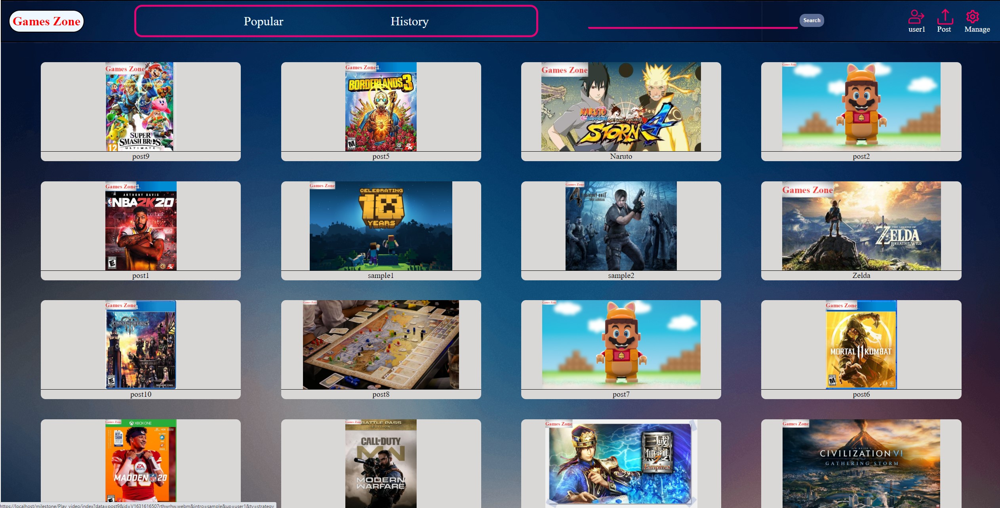

### Video Page
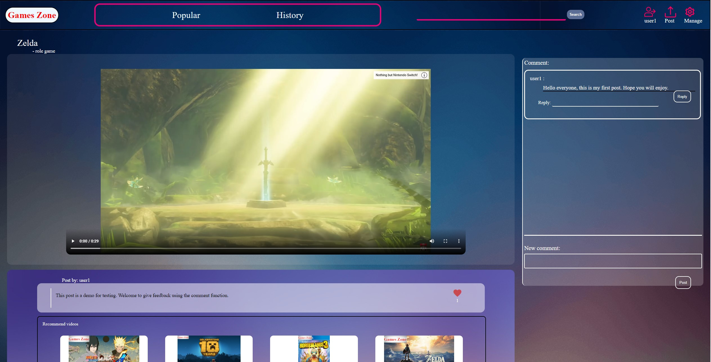

### Account

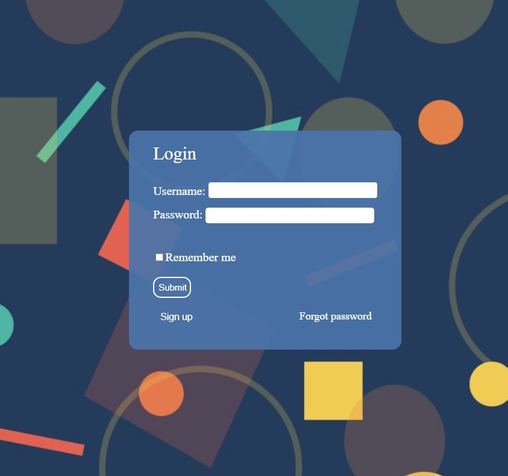
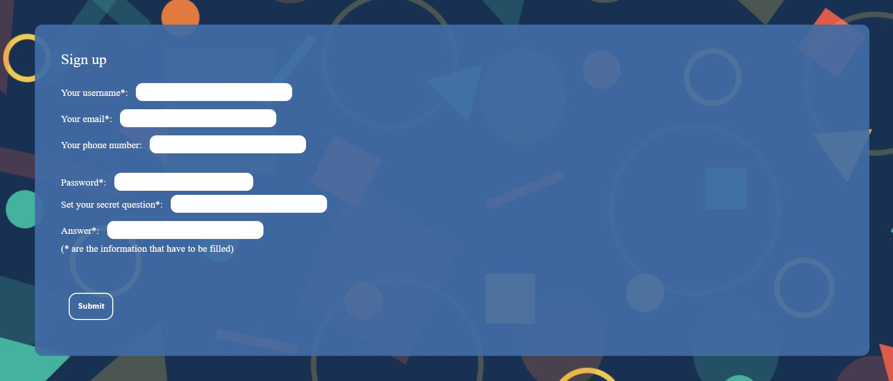

### Profile Page
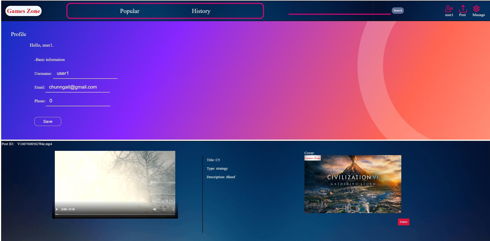

### Posting
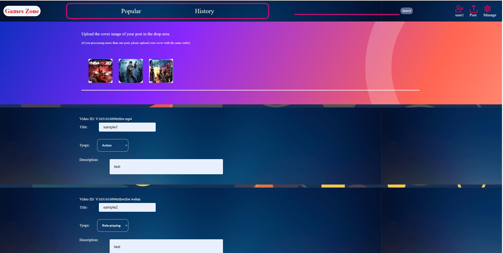

### Recommend videos
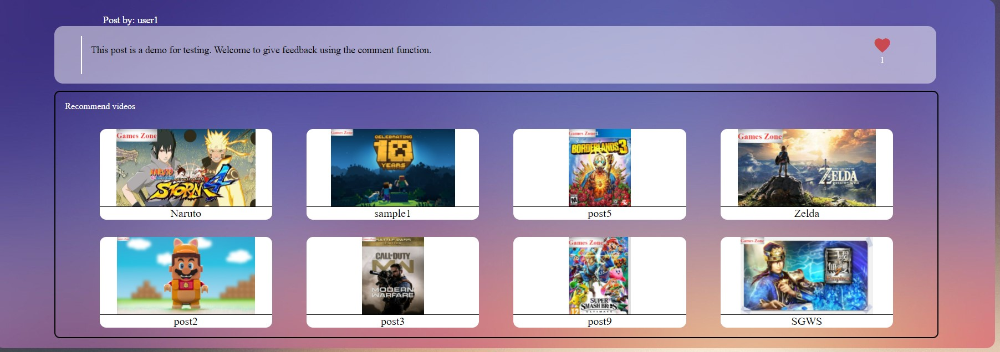

# Development
GameZone is an individual project that starts from a proposal, followed by design, structuring, functioning, styling, testing, debugging and maintaining.

### -Wireframe

### -MVC Structure

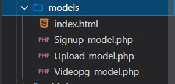
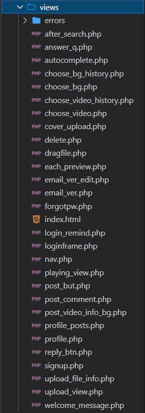
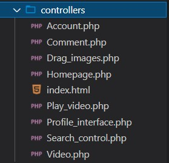

### -Database Structure
##### 1. users table
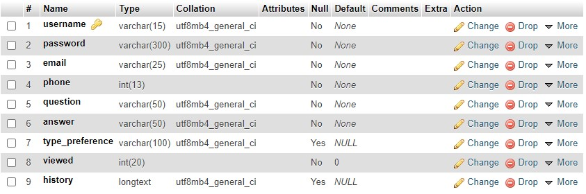

##### 1. posts table
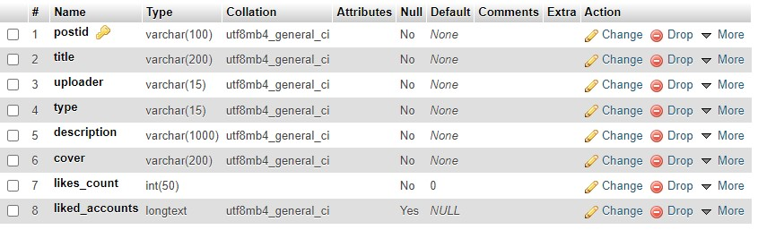

##### 1. comments table
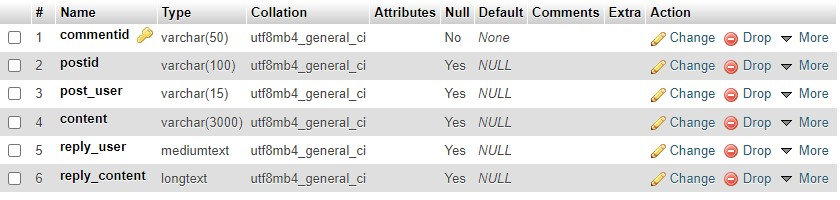

## Learnings and Challenges

#### 1. This project is the first time I have used PHP and used a database for an MVC website. For the practising purpose, most of the functions are my design using my code. 
#### 2. Code for a LogIn system is time-consuming. Because it is the first time I have tried to build a LogIn system, and it has a strong requirement on logical thinking. From the LogIn function, I have a deeper understanding of the LogIn process, how encryption work, transferring data between view and Model, proper use of session and cookies, etc.
#### 3. Experience of structuring, a good structure could simplify the project. One example is that some elements will use multiple times. And a good structure can prevent repetitive work and, therefore, make your code clean and lower cost.
#### 4. The recommend function is a very good experience. The function considers video type, total viewed amount and the view history, then it calculates user's preferences and makes it in percentage. The percentage will decide the amount of recommended videos for each type.
#### 5. The use of PHP, MVC structure, database on a website.

# What's next
#### After finishing the development, the next step is to deploy the website onto Google Cloud Platform using Linux (Ubuntu) and Docker.

	
	
	
